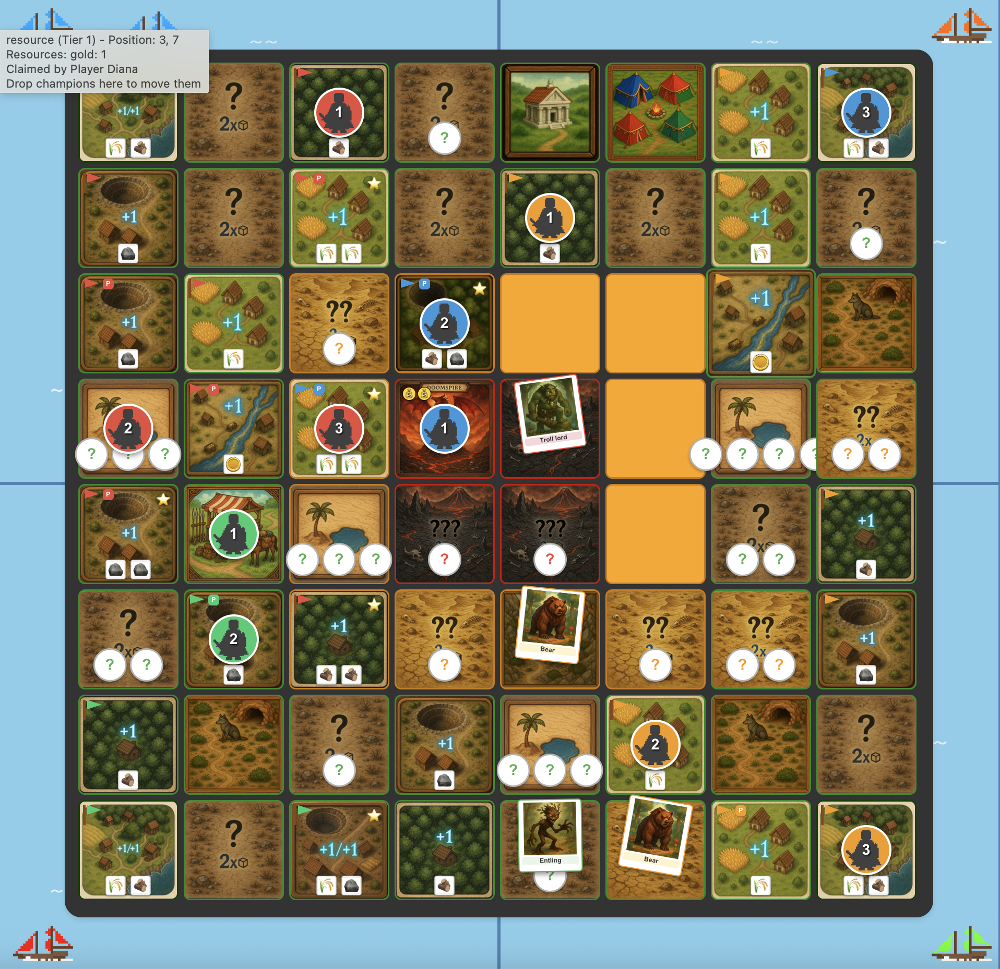

# Four Sonnets — Game Summary

**Playtest date:** 2026-07-22
**Players:** Alice (NW), Bob (NE), Charlie (SW), Diana (SE) — all four powered by Claude Sonnet.
**Length:** 19 rounds

## Final Result

| Title | Player | How |
| --- | --- | --- |
| 👑 King of Doomspire | **Bob** | Beat the dragon in combat twice, back to back (rounds 18 & 19) — with **0 fame** |
| 🤝 Hand of the King | **Alice** | 9 resource tiles (tied with Diana, won on 4 starred tiles vs 0) |
| 💰 Master of Coin | **Diana** | 1 gold. Nobody was rich — but she was the least poor |
| 🃏 Court Jester | **Charlie** | **24 fame**, seven over the impress threshold, and never set foot in Doomspire |

The headline: the fame leader by a factor of two ended up Jester, and the King ended the game with less fame than anyone. Bob spent the whole game converting fame into might at the temple, then simply punched the dragon in the face twice.

## The Story

### Act 1: Four openings (rounds 1–5)

The four players committed to four distinct strategies from turn one and, remarkably, all four stuck to them for the entire game:

- **Alice** rushed knights — she had knight #2 by round 4 and knight #3 by round 6, backed by the board's widest tile base.
- **Bob** declared a might build: mercenary camp visits, then a lifetime of temple sacrifices trading every 2 fame he earned for 1 might.
- **Charlie** went all-in on fame: exploration, a lucky round-1 Rusty Sword, and a Chapel by round 5.
- **Diana** played the aggressive raider — and paid dearly for it. She lost her first two wolf fights on rolls of 1 and spent the early game dead last on every axis.

### Act 2: Charlie's fame machine (rounds 6–11)

Charlie's engine hummed: Chapel (+3), then Monastery in round 8 (+5) put him at 13 fame while everyone else sat in single digits. His fame doubled as a political weapon — vote weight equals fame, so he single-handedly decided every council vote. In round 6 all three opponents voted to banish *him*; his lone 5-weight vote banished Bob instead. He went on to torpedo War Tax, Famine, and Fame Reversal, and later aimed Lockdown and Disarmament squarely at Bob.

Diana, meanwhile, kept throwing her 0-might champion at Charlie's 0-might champions in even coin-flip fights — and lost **three in a row** (5–6, then 3–4 after a tied reroll, then 5–6 again), feeding Charlie loot every time. Her round-7 reasoning called it "a rare, genuinely fair coin-flip opportunity." The dice disagreed, every time.

The round-11 climax: Charlie explored the first mountain tile at (4,3) and drew **The Second Ring** (+2 fame, half of an instant-win ring combo), rocketing to 19 fame — far past the 17-fame auto-impress threshold. All he had to do was find Doomspire and walk in. Twice.

### Act 3: Everyone piles on the leader (rounds 12–15)

What followed was a sustained, board-wide campaign to keep one man out of one tile.

- **Round 12:** The Dragon Sleeping fate card (combat-only impressions) made Charlie too cautious to probe the mountains. Diana attacked his ring-bearer again — and lost again (5–6).
- **Round 13:** Alice did what Diana couldn't: her might-2 champion ambushed Charlie's exposed 0-might ring-bearer at (4,2) and **stole The Second Ring** plus his gold. The same round, Charlie's own tier-3 exploration draw triggered a **Dragon Raid** that confiscated 8 tiles across the board — three of them his.
- **Round 14:** Charlie's fame-weighted Land Reform vote forced Alice to hand him a tile; she conquered it back the same round. More importantly, Charlie's champion2 explored (3,4) — not Doomspire. Alice chased him off it, then drew the **Troll Lord (might 10)** herself and fled, unintentionally leaving a monstrous roadblock on one of the two approaches to the last unexplored mountain tile. By elimination, everyone now knew: **(3,3) is Doomspire.**
- **Round 15:** Alice ambushed Charlie's champion *again* at (4,0), sending him home a third time. Then the sleeping giant woke: Bob — who had quietly stacked might to 8 while nobody was looking — flattened Alice's champion 11–5 and looted her treasury. From here on, every vote and every plan revolved around Bob.

### Act 4: The one-step race (rounds 16–18)

Round 16's Lockdown (Charlie's revenge vote) froze Bob's knights for a round. Round 17's Disarmament stripped him of 2 might. It wasn't enough.

Round 17 produced the game's best exchange. Alice, might 5, realized every unexplored hill tile hid a bear she could now beat automatically. She took (3,2) — her **4th starred tile**, satisfying the economic impress condition, one step from Doomspire. For one move phase she was set to win. Bob answered immediately: his might-9 champion attacked her on the spot, she fled home, and he **bribed the tile away for 2 gold** — killing her win condition and parking his strongest knight one step from the dragon instead.

Round 18, holding the first-player token, Bob walked into (3,3), revealed Doomspire, and fought the dragon at might 8 + Runed Dagger. He won **14–10**. Impression 1/2, plus a treasure stack. His reasoning was cold-blooded: even at ~77% odds, a loss merely killed a knight, while doing nothing guaranteed Charlie's win — "huge upside, no incremental downside."

### Act 5: One point (round 19)

Bob left his champion camped on Doomspire, which forced an automatic re-impression check at the end of his round-19 move phase. Alice had seen it coming and pre-positioned champion3 adjacent at (3,2), purely to give the dragon +2 support.

Bob saw that too. His last act of the game was to slide champion2 to (2,3) — also adjacent — for +2 support of his own.

The final roll: Bob 3 (2D3) + 10 might + 1 dagger + 2 support = **16**. Dragon 5 (2D3) + 8 might + 2 Alice = **15**.

**Bob wins by exactly one point.** Had Alice not supported the dragon, the margin would have been comfortable — but had Bob not brought his own support, the dragon would have eaten him 15–13, Doomspire would have stood open, and 24-fame Charlie would have strolled in. Instead: King Bob, and the fame leader cleans up the mess.

## Postscript

- **Bob** played the game's most coherent strategy: he treated fame as a currency, not a score, sacrificing it at the temple all game (he ended with 0). His round-17 counter-bribe of Alice's 4th starred tile and the round-19 self-support were both game-saving reads. He was also the table's designated villain by the end — targeted by Banishment, Lockdown, *and* Disarmament — and won anyway.
- **Charlie** ran a nearly flawless fame rush (24 fame by round 14, when 17 wins) but couldn't solve the last three steps of the map. His 0-might champions were mugged by Alice three separate times, the Troll Lord blocked one approach, and he lost the race to the tile itself by exactly one round. A masterclass in winning the scoreboard and losing the board. Court Jester at 24 fame.
- **Alice** was the game's disruptor-in-chief: she stole The Second Ring, harassed Charlie's rush to a standstill, briefly held a win condition of her own, and came one dragon-support point from cracking Bob's coronation. Hand of the King was a fair consolation for the best defensive game at the table.
- **Diana** went 0–3 in PvP combat (plus one flee) and never gained a point of might, but her relentless tile-grabbing (including bribing and conquering tiles from Bob, Charlie, and Alice) got her to 9 tiles and the Master of Coin title — with a single gold piece.

### Notable dice and drama

- The championship margin was **16–15**, on a fight where Bob rolled a 3 and the dragon rolled a 5. The entire game came down to Bob's dagger and a support token.
- Diana's PvP combat record: 0–3, all true 50/50 coin-flips, including one lost on a tied reroll.
- Charlie won three defensive coin-flips at 0 might, then lost the ring the one time a might-2 attacker showed up.
- Alice fleeing from the Troll Lord she herself revealed at (3,4) accidentally created the roadblock that helped doom Charlie's rush.
- The dragon confiscated 8 tiles via Dragon Raid — drawn by Charlie, who lost the most tiles to his own card.

### Playtest / simulator observations

- **API error at a key moment:** In round 18, Charlie's dice action failed with a Claude API network error and fell back to a random action — his planned double tile-claim turned into two trader interactions (randomly buying The Hedgehog). The game was likely already decided, but the fallback burned a critical positioning turn for the player in second place.
- **Turn order and Doomspire camping decided the endgame again** (as in the 2026-07-19 match): Bob's round-18 first-player token let him beat Charlie to the reveal, and the camp-and-re-impress rule let him convert one trip into two impressions.
- The **support rule created a genuinely great finale** — both Alice's dragon-support play and Bob's counter-support were explicit, well-reasoned moves, and the ±2 swings were exactly what made the final roll a one-point game.
- **Fame-weighted voting** made the fame leader nearly untouchable politically for most of the game (Charlie decided every vote from round 6 to 17), yet fame did nothing to stop a combat rush at the end. That asymmetry is thematic but worth watching.
