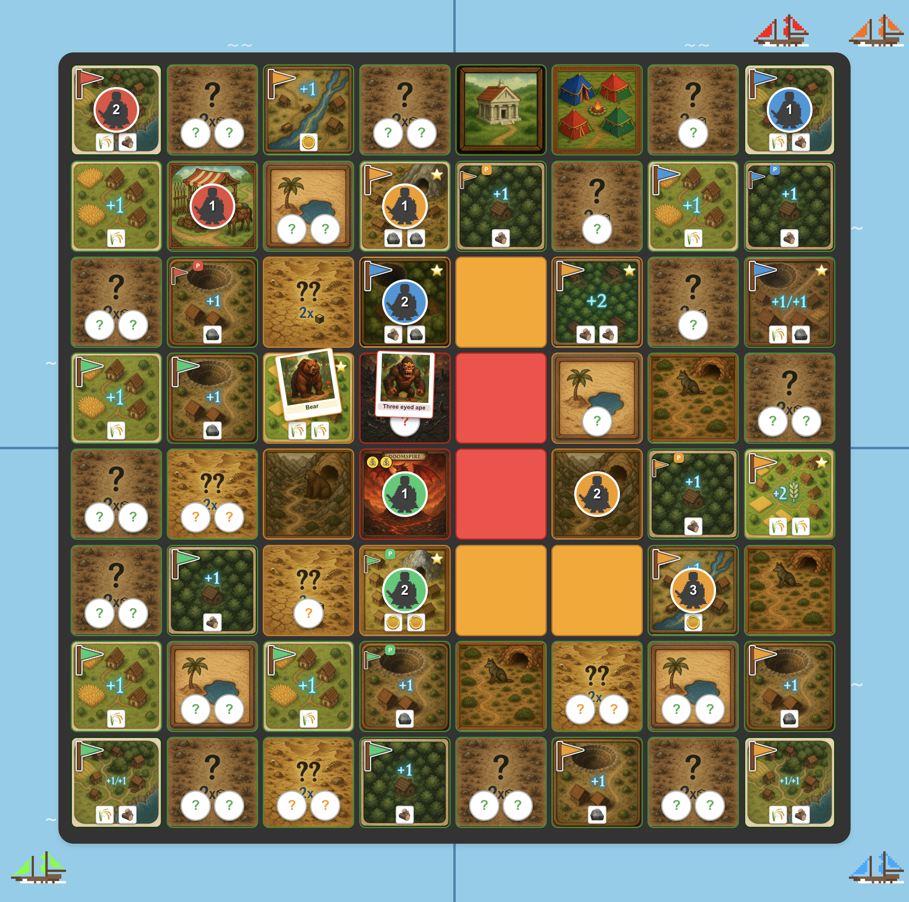

# Four Claudes — Game Summary

**Playtest date:** 2026-07-26
**Players:** Sam (NW, Sonnet 5), Sarah (NE, Sonnet 5), Oliver (SW, Opus 5), Fabian (SE, Fable 5)
**Length:** 14 rounds — the shortest of the three playtests so far

## Final Result

| Title | Player | How |
| --- | --- | --- |
| King of Doomspire | **Oliver** (Opus 5) | Two automatic 12+ gold impressions, rounds 13 & 14. Never fought the dragon, never lost a fight, never rolled a die he could lose |
| Hand of the King | **Fabian** (Fable 5) | 10 resource tiles, 3 starred — the widest board presence at the end |
| Master of Coin | **Sarah** (Sonnet 5) | **0 gold**, won on the total-resources tiebreak, 4 to Sam's 1 |
| Court Jester | **Sam** (Sonnet 5) | Found The Dragon's Egg on the very first move of the game and still had it in his pocket when the game ended |

The headline: the player who drew a free dragon impression on turn one finished last, and the player who spent eight rounds at zero fame, zero might, and zero fights won without the dragon ever rolling a die against him. Oliver's whole game was one idea executed without deviation — get to 12 gold, then take one step.

## The Story

### Act 1: The egg, and the wolf that would not die (rounds 1–4)

Sam opened with the most aggressive move on the board: a 4-step sprint into the unexplored hill at (2,2), which flipped over **The Dragon's Egg** — a free dragon impression, half a win condition, on the first action of the game. Every other player named him as the threat in their reasoning, and kept naming him for the next ten rounds.

Then the dice took over. Attacking a might-2 wolf at 0 might is a 67% proposition, and the table went **2 for 9** on those fights across the whole game. The wolf guarding the starred 2-ore tile at (1,3) was the centerpiece: it beat off Sarah, Fabian, and Sam in the same round, then Fabian again two rounds later — four straight wins, three of them on a rolled 1. It only died when Sam walked to the trader and spent 1 gold on a Spear, turning the fight into an automatic win.

Oliver did none of this. He claimed an adjacent tile every round, built the game's first Market in round 2, and by round 6 held eight claims — double anyone else — with 0 fame, 0 might, and not a single combat to his name.

### Act 2: Everybody finds the same equation (rounds 5–9)

The first player to work out that support changes everything was Fabian, in round 5, and the turn he built out of it is the best single play of the match. He had two knights, no might, and a hand of mediocre dice. So he spent one die moving his **boat** from the southwest to the southeast zone, picking up champion2 from his home tile and dropping it directly onto the wolf-guarded starred tile at (4,7) — where champion1 was already standing one tile away at (5,7). Minimum roll 1, plus 2 for support, beats a might-2 wolf every time. Guaranteed kill, and his first starred tile.

Then came the elegant half. He moved champion1 off (5,7) three steps to the wolf den at (3,6) — and the knight his boat had just delivered to (4,7) was now sitting diagonally adjacent to *that* tile, supplying +2 to the fight. The delivered knight had become the support for the deliverer. Two guaranteed wolf kills, one claimed starred tile, and 4 food out of a turn that contained no favourable dice and no might whatsoever. Both combat rolls came up 1; neither mattered.

That was two full rounds before anyone else articulated the support arithmetic. Round 7 then saw a strange convergence: Sarah, Oliver, and Fabian all built a Fletcher in the same harvest phase, and within two rounds all four players had independently derived the same piece of arithmetic in their reasoning — **at might 2 with one adjacent supporting knight, a might-5 bear is a guaranteed kill** (1D3 + 2 + 2 is never less than 5). Every starred tile on the board sat behind a bear, so this was the gate to the entire midgame.

Oliver got through it first, and the council votes helpfully cleared his path. Round 9's Fame Reversal knocked Sam down 2 fame and, because Oliver had the *fewest* fame on the board, handed Oliver +2 — the leading player was literally rewarded by the anti-leader card. Round 10's Disarmament was worse: Sam, Sarah, *and* Oliver all voted for Fabian, erasing the might 2 he had spent two rounds of Fletcher fuel building. Fabian read the message correctly ("the table sees me as a threat") and rebuilt through a temple sacrifice instead. Nobody voted for Oliver, because at 0–2 fame he did not look like anything.

### Act 3: The hill campaign and the pivot to gold (rounds 10–11)

Round 10 was Oliver's breakout. He walked champion1 into the unexplored hill at (5,2) — picking up a Proud Mercenary follower — then walked champion2 into (5,3), killed the bear on the guaranteed-support math, and claimed a starred **2-gold** tile.

Round 11 he did it twice more, clearing the bear at (4,2) and the wolf at (6,4) without risk, and then converted the pile of monster food into money: **8 food + 3 wood + 1 ore sold at 2:1 for 6 gold**, reaching 10 gold in a single harvest phase. In the same turn's reasoning he switched his primary win route from 4 starred tiles to 12 gold, and wrote down the rule that decided the game:

> Hard rule going forward: do not enter any unexplored mountain tile until I hold 12+ gold.

Three of the four mountain tiles were still face down. Everyone else was still trying to work out how to survive them; Oliver had decided he simply would not go until arriving there was free.

Elsewhere in the same round, Sam finally cracked a bear with the Löng Swörd plus support and took a second starred tile, Sarah fired her Blacksmith and Fletcher in the same harvest to jump from might 1 to 3, and Fabian clawed back to might 2.

### Act 4: The table hunts the wrong player (rounds 12–13)

Round 12's Banishment vote went 16-weight against **Sam** — Sarah, Oliver, and Fabian all voting together, Sam voting for Oliver alone. His knights went home, and he responded by gambling the egg-carrier on a 6-step sprint into the unexplored mountain at (3,3), a 1-in-4 shot at Doomspire. It was a tier-3 adventure tile hiding a might-7 three-eyed ape; he fled. The one lasting effect was cartographic: (3,3) was now known *not* to be Doomspire.

Then came the best sequence of the game, and it happened entirely between the three players who were not winning. Sarah worked out that Sam's egg-carrier was sitting unprotected at (2,3) at 0 might, and sprinted her might-3 knight across the board to take it. Fabian's knight was on the path at (1,4) and blocked her. He won 9 to 7 — and the +2 that made the difference on Sarah's side came from **Sam**, supporting the knight who was on her way to rob him.

Oliver, that same round, moved one knight two squares onto his own gold tile and sold his surplus down to 13 gold.

Round 13 the table finally identified the right target and put the Harvest Ban on Oliver with 17 fame-weight behind it. It cost him nothing whatsoever, because his win condition was gold he already held rather than gold he still needed. He spent **one pip** stepping champion1 from (4,2) into (4,3), it was Doomspire, and 13 gold impressed the dragon automatically with no combat roll. He took a treasure stack, left the knight standing on the tile, and banked his other two dice rather than take any risk with them.

### Act 5: A formality (round 14)

Fabian's round-13 reasoning had already called it: every approach to (4,3) was walled off by unexplored tiles, the ape at (3,3), and the bear at (4,5); attacking Oliver's supporting knight at (5,3) was about a 7% proposition; and in round 14 Oliver moved before him regardless. There was no play. Sarah reached the same conclusion and spent her turn conquering Sam's last starred tile instead.

Oliver moved nothing. The end-of-movement-phase check fired automatically, 14 gold cleared the threshold, and that was the game.

Sam finished standing in the trader tile at (1,1) — a non-combat zone he had retreated into to protect the egg — with The Dragon's Egg still in his inventory, 0 might, and both of his starred tiles conquered out from under him in consecutive rounds by Fabian and Sarah.

## Postscript

- **Oliver** played the cleanest game of the four playtests so far. He was last or near-last on fame for eight rounds, took his first combat in round 10, and won in round 14 having fought exactly three monsters — all of them with +2 support, all of them mathematically unlosable. His three key decisions were the Market in round 2, the round-11 pivot from starred tiles to gold once he noticed the remaining starred tiles were all deep in enemy territory, and the refusal to probe a mountain tile before the gold was banked. He also finished with the most fame on the board (10) despite never chasing it and never spending it.
- **Fabian** was the most active player at the table and got the most out of the least. He was the only player to win a PvP fight, the only one to use the temple, and he engineered guaranteed-win fights obsessively — the round-5 boat delivery above, the same support-chaining trick again in round 13 to make a bear kill free, conquering tiles rather than fighting for them. He rolled a 1 in seven of his ten combats and still finished with 10 tiles and Hand of the King. He also saw the ending coming a full round before it happened and correctly concluded there was nothing to be done.
- **Sarah** built the most complete engine on the board — Market, Fletcher, and Blacksmith, might 3 by round 11 — and had nothing to spend it on. Her two supported bear attacks at (2,5) both failed at 67%, her egg heist was intercepted, and by round 13 her own reasoning noted that every starred tile on the board except one was already claimed. Master of Coin with zero gold is a fitting summary of the game she had.
- **Sam** drew the single luckiest card in the deck on the first move and it may have cost him the game. The egg made him the table's designated threat from round 1 — he ate the Banishment, the Fame Reversal, and an attempted mugging — while it never actually did anything, because the egg solves the *impressing* problem and his real problem was that he had 0 might and could not physically reach the middle of the board. He never bought might, never built past a Market, and both of his starred tiles were taken from him in the last two rounds.

### Notable dice and drama

- Unsupported 0-might attacks on might-2 wolves: **2 wins in 9 attempts**, against 67% odds. The wolf at (1,3) alone went 4–0 before a 1-gold Spear ended it.
- Oliver's combat record: 3 fights, 3 wins, 0 PvP encounters, 0 dragon fights. He never entered a fight he could lose.
- The dragon ate nobody and was never fought. Two players (Sam, Fabian) explicitly declined to probe the mountains because they could not survive it; Oliver only went when it was free.
- Sam supported the knight that was coming to steal his egg — defensible on the turn (a Sarah win at (1,4) would have ended her movement short of him anyway), but a striking line in the log.
- Fabian was voted down to 0 might in round 10 by a unanimous three-player Disarmament, rebuilt to 2 by sacrificing fame at the temple, and used that exact might value to kill three bears.

### Playtest / simulator observations

- **No API errors this game** — a clean run, unlike the previous two playtests where fallback random actions burned critical turns.
- One rejected dice action (Oliver, round 8: "Dice value 0 not found in remaining dice"). The agent recovered within the same turn with no impact.
- **The 12-gold route has now won two of three playtests, both times without any dragon combat.** Combined with the park-at-Doomspire rule, a single knight move converts into two impressions. This game had *zero* counterplay window: Doomspire was revealed in round 13 and the game ended in round 14, with no rival knight within reach at any point. Worth considering whether the gold threshold should be a payment rather than a check, or whether the second impression should require something the table can contest.
- **Fame-as-vote-weight keeps punishing the visible player rather than the leading one.** Oliver sat at 0 fame through round 8, was *rewarded* +2 by Fame Reversal as the lowest-fame player, and drew no hostile votes until round 13 — by which point the Harvest Ban was worthless against him. All three playtests have now shown this asymmetry; it is thematic, but it means any win condition other than fame comes with political immunity.
- **The bear gate is fully deterministic.** All four LLM players independently derived "might 2 + adjacent knight = guaranteed bear kill," because 1D3 + 2 + 2 has a minimum of exactly 5 against bear might 5. Once found, the hills stop being a risk decision and become an execution checklist. Nudging bears to might 6, or the support bonus to +1, would restore a real choice there.
- **Conversely, the early wolf gate is pure variance.** Three players had their openings frozen for six-plus rounds by losing 67% fights, while the fourth simply never took one. The Spear (1 gold, +1 vs beasts) is the correct answer and only one player found it — which is arguably good design, but the tempo swing between "fought wolves" and "didn't" was enormous.
